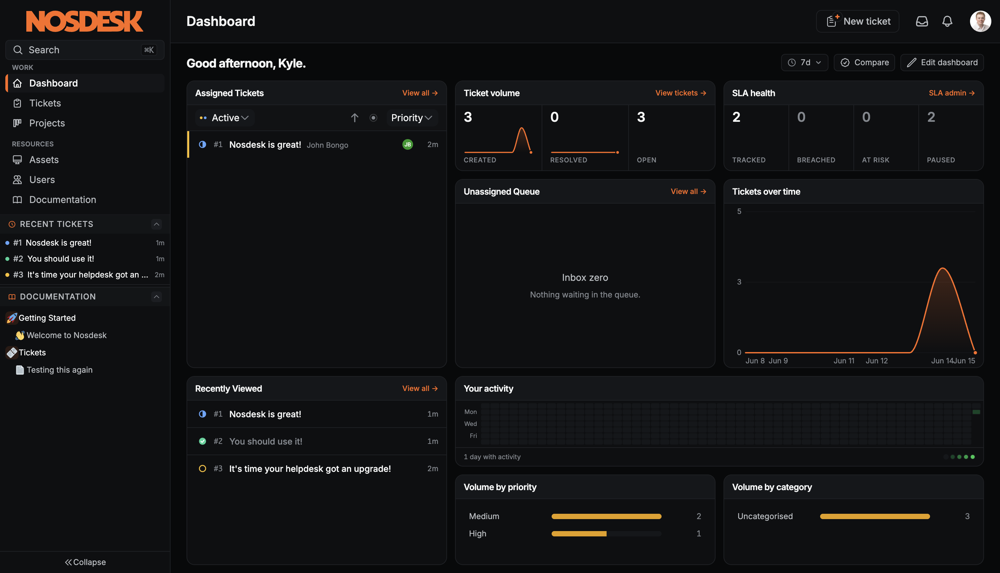

<p align="center">
  
</p>

<p align="center">
  <strong>A modern helpdesk built for teams who value speed and simplicity</strong>
</p>

<p align="center">
  <a href="https://nosdesk.com">Website</a> ·
  <a href="https://nosdesk.com/docs">Documentation</a> ·
  <a href="https://github.com/Nosdesk/Nosdesk/issues">Report a Bug</a>
</p>

---

<p align="center">
  
</p>

## What is Nosdesk?

Nosdesk is an open source helpdesk built for frictionless collaboration. Every part of the system, from tickets and projects to users, devices, and documentation, is designed to let teams work together without getting in the way.

## Features

- **Tickets** with real-time collaborative editing, voice notes, and file attachments
- **Projects** with Kanban boards and progress tracking
- **Documentation** built on real experience, seamlessly incorporating ticket notes into a readily accessible knowledge base
- **Users and Devices** linked to relevant tickets, with Microsoft Intune sync
- **Authentication** via local accounts with MFA, Microsoft Entra ID, or any OIDC provider
- **Theming** with dark mode and custom branding

## Quick Start

You'll need Docker and Docker Compose installed.

```bash
# Clone the repository
git clone https://github.com/Nosdesk/Nosdesk.git
cd Nosdesk

# Create your environment file
cp .env.example .env
```

Open `.env` and set the required values:

```bash
# Generate these with: openssl rand -base64 32
JWT_SECRET=your-generated-secret

# At-rest encryption KEK. Generate with: openssl rand -hex 32
# Versioned for zero-downtime rotation; see docs for MFA_KEK_VERSION.
MFA_KEK_V1=your-generated-key

# Change these from the defaults
POSTGRES_PASSWORD=choose-a-strong-password
REDIS_PASSWORD=choose-a-strong-password
```

Start the application:

```bash
docker compose up -d --build
```

Open [http://localhost:8080](http://localhost:8080) in your browser. On first launch, you'll be guided through creating your admin account.

## Deployment

The Compose stack above is the fastest path to a running instance. For
production, including managed Postgres (Fly, RDS, Cloud SQL), TLS,
backups, and the superuser-to-migrate vs restricted-role-at-runtime
split, see the [installation guide](https://nosdesk.com/docs/operations/installation).

## Technology

| Component | Stack |
|-----------|-------|
| Backend | Rust, Actix-web, PostgreSQL, Redis |
| Frontend | Vue.js 3, TypeScript, Tailwind CSS |
| Real-time | WebSockets, Yjs CRDT, ProseMirror |

## Development

```bash
# Start with hot reloading (binds to 127.0.0.1 only)
docker compose -f compose.yaml -f compose.dev.yaml up -d --build

# View logs
docker compose -f compose.yaml -f compose.dev.yaml logs -f

# Run database migrations
docker compose -f compose.yaml -f compose.dev.yaml exec nosdesk diesel migration run
```

By default the dev backend is reachable only from `localhost` to avoid LAN
exposure. To test collaboration features from other devices, expose the
backend on all interfaces:

```bash
BACKEND_BIND=0.0.0.0 docker compose -f compose.yaml -f compose.dev.yaml up -d --build
```

## CLI tools

Nosdesk ships a `nosdesk-cli` binary for plugin authoring, signing, and
break-glass admin operations. It's in the production image at
`/usr/local/bin/nosdesk-cli`, or build it locally with
`cargo install --path backend --bin nosdesk-cli` (the `backend` crate
needs `libpq`).

```
nosdesk-cli plugin gen-key  --out ~/.nosdesk/plugin-key
nosdesk-cli plugin sign     <plugin-dir> --key <sk> --out <zip> --source <tier>
nosdesk-cli plugin verify   <zip>
nosdesk-cli plugin install  <zip>

nosdesk-cli admin reset-password <email>
nosdesk-cli admin clear-mfa      <email>
```

The `admin` subcommands and `plugin install` talk to the database
directly, so they need `DATABASE_URL` set; signing and verifying are
offline file-IO.

## License

Nosdesk is licensed under the Business Source License 1.1. See the [LICENSE](LICENSE) file for details.

Copyright (c) 2026 Nosdesk Pty Ltd.

## Trademark

Nosdesk&trade; and the Nosdesk logo are trademarks of Nosdesk Pty Ltd. The license above grants no right to use these marks (see the trademark reservation in the [LICENSE](LICENSE)); you may not use the Nosdesk name or logo to brand a derivative or fork in a way that implies endorsement or affiliation.
